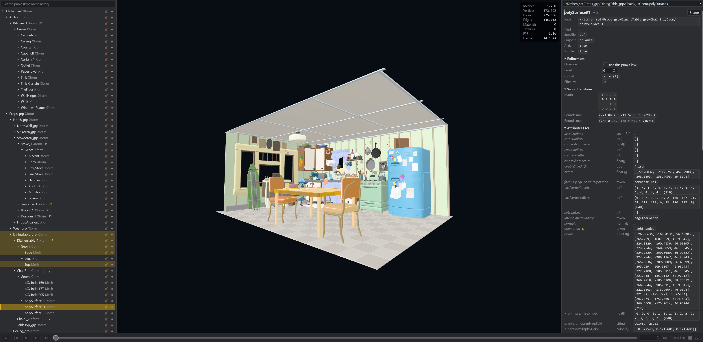

#  USD Web Viewer

A browser viewer and light editor for [OpenUSD](https://openusd.org) (Universal Scene Description) files. The official OpenUSD 26.08, with Hydra 2, OpenSubdiv and MaterialX, runs in a WebAssembly core, and three.js draws the result with WebGPU, falling back to WebGL2.



## Features

- **Opens** USD, usda, usdc and usdz, with references, payloads, variants, instancing, subdivision, MaterialX and UsdPreviewSurface materials, lights, cameras, animation and skinning. Sources are files, folders and URLs.
- **Inspects** through a hierarchy with search and change markers, a property panel whose values copy with a click, statistics, display modes with true face-edge wireframes, skies and camera settings.
- **Edits** with a transform gizmo, attributes, visibility, variants and refinement. Everything can be undone, and changes save back to the files.
- **Embeds** as a `<usd-viewer>` web component with a typed API.

Link to test the [viewer](https://cybernaut0815.github.io/USD_WebViewer/).

## Dependencies

- **Node.js 24+**, for the page and the tests. npm installs three.js, Vite, TypeScript and Playwright.
- **To build the core:** CMake 3.27+, Ninja and [emsdk](https://github.com/emscripten-core/emsdk) with Emscripten 5.0.7. The SDK superbuild fetches oneTBB, OpenSubdiv, MaterialX and OpenUSD itself.
- **A Chromium-based browser** for the full feature set. Saving in place uses the File System Access API.

## Installation

On Windows, two scripts in the repo root work by double-click:

- **`build.bat`** installs the npm packages and builds the page into `web/dist`. If the wasm core is missing and emsdk is set up (`%EMSDK%`), it builds the SDK and the core first (see [Building the core](#building-the-core)).
- **`start.bat`** serves `web/dist` at <http://localhost:4173> and opens the browser. It runs `build.bat` first when there is no build, and opens the mock stage when the build has no core. Close its window to stop the server.

All npm commands run inside `web/`; the repo root has no `package.json`.

```
cd web
npm install
npm run dev        # http://localhost:5173/?src=samples/showcase.usda
```

The page needs the wasm core in `web/public/core/` (see [Building the core](#building-the-core)). Without it, the page runs against a small mock: `http://localhost:5173/?core=mock-core/&src=mock.usda`.

| Command (in `web/`) | Does |
|---|---|
| `npm run dev` | Dev server with hot reload |
| `npm run build` | Type-check and build the viewer page into `web/dist` |
| `npm run build:lib` | Build the embeddable `usd-viewer.js` into `web/dist-lib` (three.js stays a peer dependency) |
| `npm test` | Unit tests |
| `npm run e2e` | Browser tests (Chromium, WebGL2 backend); `npm run e2e:update` refreshes the golden images |

## Building the core

Two steps: the SDK (oneTBB, OpenSubdiv, MaterialX, OpenUSD; about an hour, once), then the core against it (minutes). The core build copies `usdcore.js` and `usdcore.wasm` into `web/public/core/`.

### Windows

```
sdk\build.bat    [emsdk dir] [work dir]
native\build.bat [emsdk dir] [work dir] [Release|Debug]
node native\test\smoke.mjs
```

The emsdk directory defaults to `%EMSDK%` (set by `emsdk_env.bat` or `emsdk activate --permanent`), the work directory to `build\` in the repo. Give both scripts the same work directory. If the SDK build fails on long paths, pass a short one such as `C:\uw`.

### Linux and macOS

```
source <emsdk>/emsdk_env.sh
cmake -S sdk -B build/sdk-build -G Ninja -DSDK_PREFIX=$PWD/build/sdk && cmake --build build/sdk-build
emcmake cmake -S native -B build/core -G Ninja -DSDK_PREFIX=$PWD/build/sdk && cmake --build build/core
node native/test/smoke.mjs build/core
```

Tests: `node native/test/smoke.mjs` checks the core under Node, `npm test` the page's unit tests, and `npm run e2e` the viewer in Chromium. The e2e tests use the mock core, plus the real core once it is built. Pixar's Kitchen_set adds a larger test when it is downloaded into `web/public/test-assets/Kitchen_set`.

## Documentation

| | |
|---|---|
| [Using the viewer](docs/using.md) | Navigation and selection, panels, hierarchy symbols, editing, copying, display options, statistics |
| [Embedding and API](docs/embedding.md) | `<usd-viewer>` element, host page requirements, API, asset sources and gateways |
| [Architecture and status](docs/architecture.md) | How the page and the core work together, repository layout, what is verified, known limits |

The bundled skies are CC0 HDRIs from [Poly Haven](https://polyhaven.com); see [web/public/skies/LICENSE.md](web/public/skies/LICENSE.md). The USD logo is Pixar's, from [openusd.org](https://openusd.org).

## License

[Apache 2.0 with the Commons Clause](LICENSE): free to use, modify and share, including inside companies, but not to sell, or to sell a product or service whose value comes mainly from this viewer. This makes it source-available rather than OSI open source. Third-party parts keep their own licenses, listed at the top of [LICENSE](LICENSE).
